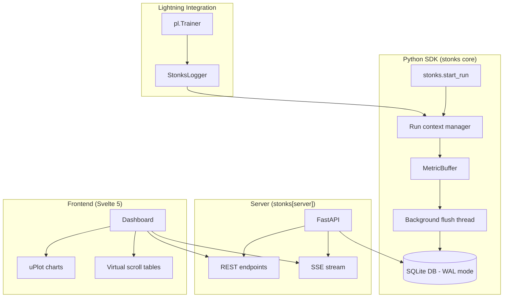

# feat: Build ML Experiment Tracker MVP

## Overview

Build **stonks**, a lightweight, local-first ML experiment tracking library and dashboard. It provides a Python SDK for logging metrics/hyperparameters from training scripts (standalone or via PyTorch Lightning), stores data in SQLite, and serves a real-time Svelte 5 dashboard via FastAPI.

The core value proposition: zero-config experiment tracking that works locally, requires no account or cloud service, and stays out of the way of the training loop.

## Problem Statement

Existing ML experiment tracking tools (W&B, Neptune) have extortionate pricing. Open-source alternatives (MLflow, Aim) are heavyweight with complex deployment requirements. Researchers need a simple, local-first tool that:

- Logs metrics with near-zero overhead (non-blocking writes)
- Works as a standalone library OR as a PyTorch Lightning logger
- Provides a responsive dashboard for visualizing training progress
- Requires zero infrastructure beyond `pip install`

## Proposed Solution

A three-component architecture with minimal coupling:

```
TRAINING TIME:
  Training Script
      |
      v
  stonks.start_run() / StonksLogger
      |
      v
  In-memory MetricBuffer --> Background flush thread --> SQLite (WAL mode)

VIEWING TIME:
  Browser <--> Svelte 5 Dashboard
      |              |
      v              v
  REST API      SSE Stream
      |              |
      v              v
  FastAPI Server --> SQLite (read-only connection)
```

## Technical Approach

### Architecture



### Tech Stack Decisions

| Component | Choice | Rationale |
|-----------|--------|-----------|
| **Package manager** | uv | Required by CLAUDE.md |
| **Python backend** | FastAPI | Async-native, Pydantic validation, auto-OpenAPI, SSE support via sse-starlette |
| **Frontend** | Svelte 5 + TypeScript + Vite | Compile-time (no VDOM), ~3KB runtime, runes API for explicit reactivity, larger ecosystem than SolidJS |
| **Charts** | uPlot | 35KB, purpose-built for time-series, handles millions of points, Svelte wrapper available |
| **Database** | SQLite (WAL mode) | Zero deps (stdlib), proven for experiment tracking (MLflow default), concurrent reads during writes |
| **Real-time** | SSE (Server-Sent Events) | Unidirectional (sufficient for metrics push), auto-reconnect via EventSource API, simpler than WebSockets |
| **Virtual scrolling** | TanStack Virtual (Svelte adapter) | Framework-agnostic, handles dynamic row heights, well-maintained |
| **Python logging** | loguru | Required by CLAUDE.md |
| **Type checking** | ty | Required by CLAUDE.md |
| **Linting** | ruff (with PLC0415) | Required by CLAUDE.md |
| **Testing (Python)** | pytest + pytest-asyncio + httpx | Fixture-based, async support, FastAPI test client |
| **Testing (Frontend)** | Vitest | Fast, Vite-compatible, Svelte support |

### Key Design Decisions

**D1: DB location defaults to `./stonks.db` in CWD.** Override with `db=` parameter or `STONKS_DB` env var. The `stonks serve` command uses `--db` flag. This keeps things simple and predictable.

**D2: Logging failures are swallowed by default.** `run.log()` catches exceptions, logs warnings via loguru, and continues. A `strict=True` option on `start_run()` propagates errors. A 3-day training run should never die because of a transient disk issue.

**D3: Write batching with background thread.** `run.log()` appends to an in-memory buffer (thread-safe via lock). A background thread flushes every 1 second or every 100 entries, whichever comes first. Target: <1ms overhead per `run.log()` call. Buffer is flushed on `run.finish()` / context manager exit.

**D4: SQLite busy_timeout = 5000ms.** Handles concurrent writes from multiple training jobs without immediate failure.

**D5: Orphaned run detection via heartbeat.** Each `run.log()` call updates `last_heartbeat` on the run row. Dashboard shows runs with no heartbeat for >1 hour as "presumed dead". CLI command `stonks cleanup` marks them as interrupted.

**D6: Scalars only for v1.** `run.log()` accepts `dict[str, int | float]`. NaN stored as NULL, Inf rejected. Images/tensors/artifacts are out of scope.

**D7: Frontend bundled into Python package.** Svelte builds to `stonks/server/static/`. Served by FastAPI's `StaticFiles`. No `npm install` required for end users. Only developers building from source need Node.js.

**D8: Optional dependencies via extras.** Core library has minimal deps (loguru only). `pip install stonks[lightning]` adds PyTorch Lightning. `pip install stonks[server]` adds FastAPI/uvicorn. `pip install stonks[all]` for everything.

**D9: Server-side downsampling for large datasets.** Metrics endpoint supports `?downsample=1000` parameter using min-max decimation. Full resolution available for zoom-in via range queries.

### SQLite Schema

```sql
CREATE TABLE experiments (
    id TEXT PRIMARY KEY,              -- UUID
    name TEXT NOT NULL UNIQUE,
    description TEXT,
    created_at REAL NOT NULL,         -- Unix timestamp
    metadata JSON                     -- Flexible key-value storage
);

CREATE TABLE runs (
    id TEXT PRIMARY KEY,              -- UUID
    experiment_id TEXT NOT NULL REFERENCES experiments(id),
    name TEXT,                        -- Optional display name
    status TEXT NOT NULL DEFAULT 'running',  -- running|completed|failed|interrupted
    config JSON,                      -- Hyperparameters as JSON
    created_at REAL NOT NULL,
    ended_at REAL,
    last_heartbeat REAL,              -- Updated on each log() call
    FOREIGN KEY (experiment_id) REFERENCES experiments(id)
);

CREATE TABLE metrics (
    id INTEGER PRIMARY KEY AUTOINCREMENT,
    run_id TEXT NOT NULL,
    key TEXT NOT NULL,                -- e.g. "train/loss", "val/accuracy"
    value REAL,                       -- NULL for NaN
    step INTEGER NOT NULL,
    timestamp REAL NOT NULL,
    FOREIGN KEY (run_id) REFERENCES runs(id)
);

-- Primary query index: get metric series for a run
CREATE INDEX idx_metrics_run_key_step ON metrics(run_id, key, step);

-- SSE polling index: get new metrics since timestamp
CREATE INDEX idx_metrics_run_timestamp ON metrics(run_id, timestamp);

-- Dashboard listing index
CREATE INDEX idx_runs_experiment ON runs(experiment_id, created_at DESC);
CREATE INDEX idx_experiments_created ON experiments(created_at DESC);
```

### REST API Contract

```
GET  /api/experiments                              -- List all experiments
POST /api/experiments                              -- Create experiment (used internally by SDK)
GET  /api/experiments/{id}                         -- Get experiment details
GET  /api/experiments/{id}/runs                    -- List runs in experiment
GET  /api/runs/{id}                                -- Get run details + config
GET  /api/runs/{id}/metrics?key=train/loss&downsample=1000  -- Get metric series
GET  /api/runs/{id}/metric-keys                    -- List available metric keys for a run
GET  /api/events?experiment_id={id}                -- SSE: stream new metrics + run status changes
```

### Implementation Phases

#### Phase 1: Foundation (Python SDK + SQLite)

Build the core logging library that works standalone without a server.

**Files to create:**

- `pyproject.toml` -- Project config, deps, ruff/ty/pytest config
- `.python-version` -- Pin Python version (3.11+)
- `stonks/__init__.py` -- Public API: `start_run()`, `open()`, `Run`, `Database`
- `stonks/run.py` -- `Run` class (context manager, `log()`, `finish()`)
- `stonks/store.py` -- SQLite data access layer (create/read/write)
- `stonks/buffer.py` -- `MetricBuffer` with background flush thread
- `stonks/models.py` -- Data classes: `Experiment`, `RunInfo`, `MetricPoint`
- `stonks/config.py` -- Configuration (DB path resolution, env vars)
- `stonks/logging_config.py` -- loguru setup (stdout + file, 1-week retention)
- `stonks/exceptions.py` -- Custom exception hierarchy
- `tests/conftest.py` -- Shared fixtures (tmp_db, sample_experiment, sample_run)
- `tests/unit/test_store.py` -- SQLite operations
- `tests/unit/test_buffer.py` -- MetricBuffer batching + flush
- `tests/unit/test_run.py` -- Run context manager lifecycle
- `tests/unit/test_models.py` -- Data class serialization
- `tests/integration/test_full_workflow.py` -- End-to-end: start_run -> log -> finish -> query

**Acceptance criteria:**
- [x] `stonks.start_run("exp", config={"lr": 0.001})` creates DB, experiment, and run
- [x] `run.log({"loss": 0.5}, step=1)` buffers metric and flushes within 1 second
- [x] Context manager marks run as completed/failed on exit
- [x] `stonks.open("./stonks.db").list_runs()` returns logged runs
- [x] `db.get_metrics(run_id, "loss")` returns metric series
- [x] Concurrent writes from two threads do not corrupt data
- [x] Logging errors are swallowed by default, propagated with `strict=True`
- [x] `uv run pytest` passes, `uv run ruff check .` clean, `uv run ty check stonks/` clean

#### Phase 2: PyTorch Lightning Integration

Add the `StonksLogger` that wraps the SDK for Lightning usage.

**Files to create:**

- `stonks/lightning.py` -- `StonksLogger(Logger)` with `@rank_zero_only` decorators
- `tests/unit/test_lightning_logger.py` -- Logger method tests (mocked store)

**Acceptance criteria:**
- [x] `StonksLogger("exp")` creates experiment and run on first `log_metrics` call
- [x] `log_hyperparams(params)` stores config as JSON
- [x] `log_metrics({"loss": 0.5}, step=1)` delegates to `Run.log()`
- [x] `finalize("success")` marks run as completed
- [x] `save()` flushes the metric buffer
- [x] Works alongside other loggers (`Trainer(logger=[stonks_logger, tb_logger])`)
- [x] Lightning is an optional dependency -- clean ImportError if not installed

#### Phase 3: FastAPI Server + REST API

Expose logged data via HTTP endpoints.

**Files to create:**

- `stonks/server/__init__.py`
- `stonks/server/app.py` -- FastAPI app factory, CORS, static files mount
- `stonks/server/routes/experiments.py` -- Experiment CRUD endpoints
- `stonks/server/routes/runs.py` -- Run detail endpoints
- `stonks/server/routes/metrics.py` -- Metric series + downsampling endpoints
- `stonks/server/routes/stream.py` -- SSE endpoint for real-time updates
- `stonks/server/dependencies.py` -- FastAPI dependency injection (DB connection)
- `stonks/server/downsampling.py` -- Min-max decimation algorithm
- `stonks/cli.py` -- CLI entry point (`stonks serve --db --port --host`)
- `tests/integration/test_server_api.py` -- REST endpoint tests via httpx
- `tests/integration/test_sse.py` -- SSE streaming tests

**Acceptance criteria:**
- [x] `stonks serve --db ./stonks.db` starts FastAPI on localhost:8000
- [x] `GET /api/experiments` returns experiment list
- [x] `GET /api/runs/{id}/metrics?key=loss&downsample=500` returns downsampled series
- [x] `GET /api/events?experiment_id=X` streams SSE events as new metrics arrive
- [x] Server creates empty DB if file doesn't exist
- [x] `--port` and `--host` flags work
- [x] All endpoints return proper error responses (404, 422)

#### Phase 4: Svelte 5 Dashboard

Build the frontend UI for visualizing experiments.

**Files to create:**

- `ui/package.json` -- Svelte 5, TypeScript, Vite, uPlot, TanStack Virtual
- `ui/svelte.config.js`
- `ui/vite.config.ts`
- `ui/tsconfig.json`
- `ui/src/app.html` -- HTML shell
- `ui/src/app.css` -- Global styles (minimal, clean design)
- `ui/src/routes/+layout.svelte` -- App shell with sidebar
- `ui/src/routes/+page.svelte` -- Experiment list page
- `ui/src/routes/experiments/[id]/+page.svelte` -- Experiment detail (runs list + charts)
- `ui/src/lib/components/ExperimentList.svelte` -- Experiment sidebar/list
- `ui/src/lib/components/RunTable.svelte` -- Virtualized run table with status, config summary
- `ui/src/lib/components/MetricChart.svelte` -- uPlot-based chart component
- `ui/src/lib/components/ConfigComparison.svelte` -- Side-by-side config table
- `ui/src/lib/components/EmptyState.svelte` -- Helpful empty states
- `ui/src/lib/api/client.ts` -- REST API client
- `ui/src/lib/api/sse.ts` -- SSE connection manager with auto-reconnect
- `ui/src/lib/stores/experiments.ts` -- Svelte stores for experiment/run data
- `ui/src/lib/types.ts` -- TypeScript interfaces matching Python models
- `ui/tests/ExperimentList.test.ts` -- Vitest component tests
- Build script that outputs to `stonks/server/static/`

**Acceptance criteria:**
- [x] Dashboard loads at localhost:8000 when server is running
- [x] Experiment list shows all experiments with run counts
- [x] Clicking an experiment shows its runs with status indicators
- [x] Selecting a run shows metric charts (loss curves, accuracy, etc.)
- [x] Charts render 100K data points without freezing (downsampled)
- [x] Charts update in real-time via SSE when training is active
- [x] Config comparison table shows selected runs' hyperparameters side-by-side
- [x] Empty states show helpful messages for new users
- [x] Metric keys with `/` are grouped by prefix in the UI

#### Phase 5: CI/CD and Pre-commit

Set up automated quality checks.

**Files to create:**

- `.pre-commit-config.yaml` -- ruff format, ruff check, ty check
- `.github/workflows/ci.yml` -- Python tests + lint on push/PR
- `.github/workflows/frontend.yml` -- Svelte check + Vitest on push/PR
- `.gitignore` -- logs/, .venv/, node_modules/, *.db, dist/, etc.

**Acceptance criteria:**
- [x] `pre-commit run --all-files` passes
- [x] GitHub Actions CI runs on every push and PR
- [x] CI runs `ruff format --check`, `ruff check`, `ty check stonks/`, `pytest`
- [x] CI runs `bun run check` and `bun run build` in `ui/`
- [x] Full test suite completes in under 20 seconds

### Package Structure

```
stonks/                              # Git repository
  CLAUDE.md -> AGENTS.md
  AGENTS.md
  README.md
  LICENSE
  pyproject.toml
  uv.lock
  .python-version
  .pre-commit-config.yaml
  .gitignore
  .github/
    workflows/
      ci.yml
      frontend.yml
  stonks/                             # Python package
    __init__.py                      # Public API
    run.py                           # Run context manager
    store.py                         # SQLite data access
    buffer.py                        # MetricBuffer with background flush
    models.py                        # Experiment, RunInfo, MetricPoint
    config.py                        # DB path resolution, settings
    logging_config.py                # loguru setup
    exceptions.py                    # StonksError hierarchy
    lightning.py                     # StonksLogger (optional dep)
    cli.py                           # CLI entry point
    server/                          # FastAPI server (optional dep)
      __init__.py
      app.py                         # App factory
      dependencies.py                # DI (DB connection)
      downsampling.py                # Min-max decimation
      routes/
        __init__.py
        experiments.py
        runs.py
        metrics.py
        stream.py
      static/                        # Built Svelte assets (gitignored, built from ui/)
        index.html
        assets/
  ui/                                # Svelte 5 frontend source
    package.json
    svelte.config.js
    vite.config.ts
    tsconfig.json
    src/
      app.html
      app.css
      routes/
        +layout.svelte
        +page.svelte
        experiments/
          [id]/
            +page.svelte
      lib/
        components/
          ExperimentList.svelte
          RunTable.svelte
          MetricChart.svelte
          ConfigComparison.svelte
          EmptyState.svelte
        api/
          client.ts
          sse.ts
        stores/
          experiments.ts
        types.ts
    tests/
      ExperimentList.test.ts
  tests/                             # Python tests
    conftest.py
    unit/
      test_store.py
      test_buffer.py
      test_run.py
      test_models.py
      test_lightning_logger.py
    integration/
      test_full_workflow.py
      test_server_api.py
      test_sse.py
  logs/                              # loguru output (gitignored)
```

### pyproject.toml

```toml
[project]
name = "stonks"
version = "0.1.0"
description = "Lightweight ML experiment tracking"
readme = "README.md"
requires-python = ">=3.11"
license = "Apache-2.0"
dependencies = [
    "loguru>=0.7",
]

[project.optional-dependencies]
lightning = ["lightning>=2.0"]
server = [
    "fastapi>=0.115",
    "uvicorn[standard]>=0.30",
    "sse-starlette>=2.0",
]
all = ["stonks[lightning,server]"]

[dependency-groups]
dev = [
    "pytest>=8.0",
    "pytest-asyncio>=0.24",
    "httpx>=0.27",
    "ruff>=0.8",
    "ty",
    "pre-commit>=4.0",
]

[project.scripts]
stonks = "stonks.cli:main"

[build-system]
requires = ["hatchling"]
build-backend = "hatchling.build"

[tool.ruff]
target-version = "py311"
line-length = 100

[tool.ruff.lint]
select = ["E", "F", "I", "UP", "PLC0415"]

[tool.ruff.lint.pydocstyle]
convention = "google"

[tool.ruff.lint.isort]
known-first-party = ["stonks"]

[tool.ruff.lint.per-file-ignores]
"tests/**" = ["PLC0415"]

[tool.pytest.ini_options]
testpaths = ["tests"]
asyncio_mode = "auto"

[tool.ty.environment]
python-version = "3.11"
```

## Alternative Approaches Considered

### Frontend: SolidJS vs Svelte 5
SolidJS scores 2% higher on js-framework-benchmark but has a smaller ecosystem and fewer charting library integrations. Svelte 5's compile-time approach, HTML-first syntax, and runes API make it more maintainable for a data dashboard. **Chose Svelte 5.**

### Frontend: HTMX + Alpine.js
Excellent for server-rendered CRUD, but for a data-intensive dashboard with real-time updates and thousands of data points, client-side rendering with virtualization is essential. **Rejected.**

### Storage: DuckDB vs SQLite
DuckDB excels at analytical queries (10-100x faster for aggregations) but is poor at single-row inserts -- exactly the write pattern for experiment tracking. SQLite's row-oriented storage handles incremental inserts efficiently and is in Python's stdlib. **Chose SQLite, with DuckDB as a future optional analytics layer.**

### Storage: RocksDB (Aim's approach)
Fast sequential writes but adds a C++ compilation dependency, custom format makes debugging hard, less portable. **Rejected for v1.**

### Real-time: WebSocket vs SSE
Data flow is primarily unidirectional (server pushes metrics to client). SSE uses standard HTTP, auto-reconnects via EventSource API, and works through proxies/CDNs without configuration. WebSocket's bidirectional channel is unnecessary overhead for this use case. **Chose SSE.**

## Acceptance Criteria

### Functional Requirements
- [ ] `pip install stonks` provides the standalone SDK (loguru is the only dependency)
- [ ] `pip install stonks[lightning]` adds PyTorch Lightning logger support
- [ ] `pip install stonks[server]` adds the dashboard server
- [ ] `stonks.start_run("exp", config={...})` creates DB + experiment + run
- [ ] `run.log({"loss": 0.5}, step=1)` logs with <1ms overhead
- [ ] `stonks serve --db ./stonks.db` starts the dashboard
- [ ] Dashboard shows experiments, runs, live-updating metric charts
- [ ] Two concurrent training jobs can log to the same DB

### Non-Functional Requirements
- [ ] Test suite completes in under 20 seconds
- [ ] `run.log()` overhead < 1ms (buffered, non-blocking)
- [ ] Dashboard renders 100K data points per chart without freezing
- [ ] Frontend bundle < 100KB gzipped
- [ ] Zero-config: no accounts, no cloud, no infrastructure

### Quality Gates
- [ ] `uv run ruff format --check .` clean
- [ ] `uv run ruff check .` clean
- [ ] `uv run ty check stonks/` clean
- [ ] `uv run pytest` passes with all tests green
- [ ] `npm run check` (svelte-check) passes
- [ ] `npm test` (vitest) passes
- [ ] Google-style docstrings on all public API
- [ ] All imports hoisted to top of file (PLC0415)

## CLAUDE.md Updates Needed

The current CLAUDE.md contains references that appear to be from a prior project (Textual TUI). These should be updated:

1. **Remove Textual-specific testing patterns:** References to `app.run_test()`, `size=(80, 24)`, `_start_refresh_worker`, `check_slurm_available` should be replaced with FastAPI/Svelte testing patterns
2. **Add the "stonks" package name** explicitly to the description
3. **Add Svelte/TypeScript testing choice**: Vitest for unit tests, Playwright for E2E
4. **Add frontend build instructions**: `cd ui && npm run build` to output to `stonks/server/static/`

## Dependencies & Prerequisites

- Python 3.11+
- Node.js 22+ (development only, for building the Svelte frontend)
- uv (Python package manager)

## Risk Analysis & Mitigation

| Risk | Likelihood | Impact | Mitigation |
|------|-----------|--------|------------|
| SQLite write contention with many concurrent jobs | Medium | Training slowdown | WAL mode + 5s busy_timeout + write batching |
| Dashboard freezing on large datasets | High | Poor UX | Server-side downsampling, virtual scrolling, uPlot |
| Orphaned runs from crashed training | High | Dashboard clutter | Heartbeat tracking, `stonks cleanup` command |
| Frontend bundle too large | Low | Slow initial load | Svelte compiles away, uPlot is 35KB, tree-shaking via Vite |
| NFS-mounted storage (academic clusters) | Medium | SQLite corruption | Detect NFS, warn user, document limitation |

## Future Considerations

These are explicitly **out of scope for v1** but should not be precluded by the architecture:

- Artifact tracking (model checkpoints, images, confusion matrices)
- Multi-user authentication and team collaboration
- Remote tracking server mode (client logs to HTTP server instead of local SQLite)
- DuckDB analytical query layer (`stonks[analytics]`)
- Run comparison views (parallel coordinates, scatter plots)
- Export to CSV/DataFrame
- Run tagging and notes
- Experiment/run deletion
- Lightning Fabric support
- Custom metric types (histograms, distributions, tables)

## References & Research

### Internal References
- CLAUDE.md/AGENTS.md: Project requirements and coding standards

### External References
- [MLflow Architecture](https://mlflow.org/docs/latest/self-hosting/architecture/overview/) -- Schema design, batch logging patterns
- [Aim Data Storage](https://aimstack.readthedocs.io/en/latest/understanding/data_storage.html) -- RocksDB approach analysis
- [Trackio (HuggingFace)](https://huggingface.co/blog/trackio) -- Minimalist experiment tracker inspiration
- [PyTorch Lightning Logger API](https://github.com/lightning-ai/pytorch-lightning/blob/master/docs/source-pytorch/extensions/logging.rst)
- [SQLite WAL Mode](https://sqlite.org/wal.html) -- Concurrent read/write patterns
- [SQLite Performance Optimizations](https://www.powersync.com/blog/sqlite-optimizations-for-ultra-high-performance)
- [FastAPI Official Docs](https://fastapi.tiangolo.com/)
- [SSE with FastAPI](https://github.com/sysid/sse-starlette)
- [Svelte 5 Docs](https://svelte.dev/docs)
- [uPlot](https://github.com/leeoniya/uPlot) -- Lightweight time-series charting
- [TanStack Virtual](https://tanstack.com/virtual/latest) -- Virtual scrolling
- [uv Project Guide](https://docs.astral.sh/uv/guides/projects/)
- [ruff PLC0415 Rule](https://docs.astral.sh/ruff/rules/import-outside-top-level/)
- [ty Configuration](https://docs.astral.sh/ty/reference/configuration/)
